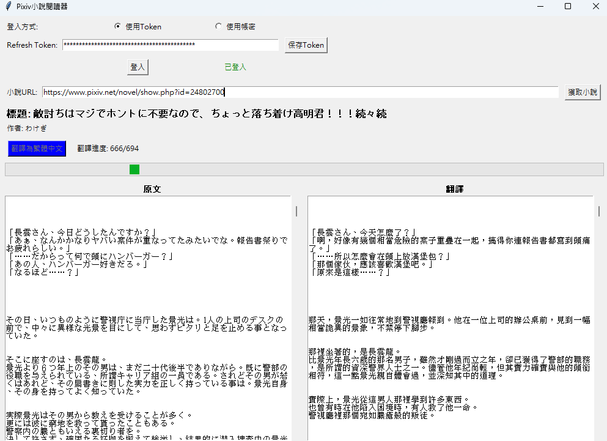

# Pixiv小說閱讀與翻譯工具



一個整合了Pixiv小說下載與中文翻譯功能的桌面應用程式，讓您可以方便地閱讀和翻譯Pixiv上的日文小說。本工具支援使用Pixiv帳號登入或Refresh Token登入，並能夠通過本地Ollama AI模型將日文小說翻譯為繁體中文。

## 主要功能

- 🔐 支援Pixiv帳號密碼或Refresh Token登入
- 📚 輕鬆獲取Pixiv小說內容
- 🔄 整合Ollama本地AI模型進行日文→繁體中文翻譯
- 📋 原文與翻譯對照顯示
- 💾 自動保存翻譯結果和原文
- 🔧 使用者友好的圖形界面

## 創作動機

因為我平常很喜歡看小說，但實在是看了接近十年的網路小說，書荒了，遂想說去看看日本小說，因此製作了這個翻譯閱讀器。之所以不用Openai的api，改用本機跑語言模型，是因為api需要錢，哪怕是gpt3.5也需要一筆費用。

所以就嘗試串了本地端的Ollama部屬的Qwen3模型，雖然是量化版本的，但在翻譯任務上已經綽綽有餘了。

## 系統需求

- Python 3.6+
- Tkinter (Python GUI庫，通常與Python一起安裝)
- 網際網路連接
- [Ollama](https://ollama.ai/) (用於本地AI翻譯)

## 安裝指南

### 1. 複製專案

```bash
git clone https://github.com/your-username/pixiv-novel-reader.git
cd pixiv-novel-reader
```

### 2. 安裝依賴套件

```bash
pip install -r requirements.txt
```

主要依賴包括：
- pixivpy3 (Pixiv API客戶端)
- gppt (獲取Pixiv Token的工具)
- requests (HTTP請求)
- tkinter (GUI庫)

### 3. 安裝Ollama (本地AI翻譯引擎)

本工具使用Ollama進行本地翻譯，無需付費API。請前往[Ollama官網](https://ollama.ai/)下載並安裝。

安裝完成後，請拉取所需模型：

```bash
ollama pull qwen3:8b
```

> 注意：您也可以使用其他支援中文翻譯的模型，只需修改程式碼中的模型名稱即可。

## 使用方法

### 1. 啟動應用程式

```bash
python mainv2.py
```

### 2. 登入Pixiv

有兩種登入方式：

**方式一：使用Refresh Token (推薦)**
- 選擇「使用Token」
- 在輸入框中輸入您的Pixiv Refresh Token
- 點擊「登入」
- 登入成功後可點擊「保存Token」以便下次使用

**方式二：使用帳號密碼**
- 選擇「使用帳密」
- 輸入Pixiv帳號和密碼
- 點擊「登入」
- 系統會自動獲取Refresh Token並保存

### 3. 獲取小說內容

- 在「小說URL」欄位中輸入Pixiv小說的網址
  - 支援格式：`https://www.pixiv.net/novel/123456789`
  - 支援格式：`https://www.pixiv.net/novel/show.php?id=123456789`
- 點擊「獲取小說」按鈕
- 小說內容將顯示在左側文本區

### 4. 翻譯小說

- 確保Ollama正在運行中
- 點擊「翻譯為繁體中文」按鈕
- 翻譯過程會即時顯示進度
- 翻譯結果將顯示在右側文本區
- 翻譯完成後會自動保存到本地文件

## 獲取Pixiv Refresh Token

如果您不希望每次都輸入帳號密碼，建議使用Refresh Token登入。獲取方法：

1. 在應用程式中使用帳號密碼登入一次
2. 登入成功後，Token會自動顯示在Token輸入框
3. 點擊「保存Token」按鈕

或者，您也可以通過瀏覽器開發者工具手動獲取：

1. 登入Pixiv網站
2. 打開瀏覽器開發者工具 (F12)
3. 切換到「應用程式」或「Storage」標籤
4. 查看Cookies中的「PHPSESSID」值

## 翻譯文件管理

翻譯結果會自動保存在應用程式目錄下的`translations`資料夾中：

- 翻譯文件命名格式：`{時間戳}_{小說標題}_translation.txt`
- 原文文件命名格式：`{時間戳}_{小說標題}_original.txt`

每個翻譯文件包含：
- 小說標題、作者、ID
- 翻譯時間
- 完整的翻譯內容

## 常見問題解答

### 登入問題

**Q: 使用帳號密碼登入失敗怎麼辦？**  
A: 請確保您的帳號密碼正確，並檢查網路連接。如果使用的是Google或Twitter登入的Pixiv帳號，請先在Pixiv網站設置密碼。

**Q: Refresh Token在哪裡保存？**  
A: Refresh Token保存在應用程式目錄下的`pixiv_config.json`文件中。

### 翻譯問題

**Q: 無法連接到Ollama怎麼辦？**  
A: 請確保Ollama程式已經啟動，並且qwen3:8b模型已經下載。默認情況下，Ollama API在`http://localhost:11434`提供服務。

**Q: 翻譯質量不佳怎麼辦？**  
A: 您可以嘗試使用更大的模型，例如`qwen3:72b`或其他翻譯模型。修改`mainv2.py`中的`translate_with_ollama`函數中的model參數。

**Q: 翻譯速度慢怎麼辦？**  
A: 翻譯速度取決於您的電腦性能和選擇的模型大小。您可以嘗試使用更小的模型或升級硬件。

### 其他問題

**Q: 我可以翻譯其他語言嗎？**  
A: 是的，您可以修改翻譯提示詞來翻譯成其他語言，但需要確保使用的模型支援該語言。

**Q: 翻譯結果有時出現奇怪的標記怎麼辦？**  
A: 程式內建了清理函數，但可能無法處理所有情況。您可以手動編輯保存的翻譯文件。

## 自定義設置

如需自定義應用程式，您可以修改以下參數：

1. **翻譯模型**：在`translate_with_ollama`函數中更改`model`參數
2. **翻譯提示詞**：在同一函數中更改`prompt`參數
3. **界面佈局**：在`setup_ui`函數中修改界面元素

## 隱私與安全

- 本工具在本地運行，不會將您的Pixiv帳號信息發送給第三方
- 翻譯過程使用本地Ollama模型，不會將內容發送至雲端
- 請妥善保管您的Refresh Token，它可以用來訪問您的Pixiv帳號

## 授權協議

本專案採用MIT授權協議。

## 致謝

- [PixivPy](https://github.com/upbit/pixivpy) - Pixiv API客戶端
- [GetPixivToken](https://github.com/eggplants/gppt) - 獲取Pixiv Token工具
- [Ollama](https://ollama.ai/) - 本地大型語言模型運行環境
- [Qwen](https://github.com/QwenLM/Qwen) - 通義千問大語言模型

---

*免責聲明：本工具僅供學習和研究使用。請尊重作者版權，不要用於商業用途。使用本工具時請遵守Pixiv的服務條款。*
